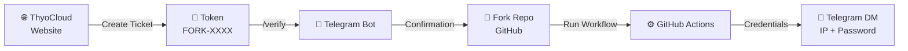

<div align="center">


[🇮🇩 Bahasa Indonesia](README.md) &nbsp;|&nbsp; **🇬🇧 English**

<a href="https://thyo.cloud">
  
</a>

<br/>

[](https://t.me/thyocloud)
[](https://github.com)
[](https://thyo.cloud)
[](https://t.me/thyocloud)
[](https://chat.whatsapp.com/D0p0nULTTheCRG9pHD6OGy)

**An automation system with layered security — from token verification to credential delivery, everything runs automatically and out of sight.**

</div>

---

## 🏆 Community Milestones

<div align="center">

[](https://github.com/Thyo1/ThyoCloud-RDP/fork)
[](https://github.com/Thyo1/ThyoCloud-RDP/stargazers)
[](https://github.com/Thyo1/ThyoCloud-RDP/watchers)


| ⏱️ Session Length | 🔐 Credentials | 🆓 Cost |
|:---:|:---:|:---:|
| **Up to 6 hours** | **Via Telegram DM** | **Free** |

### 📈 Star Growth

<a href="https://star-history.com/#Thyo1/ThyoCloud-RDP&Date">
  
</a>

*Thank you to everyone who trusts ThyoCloud! 💙*

</div>

---

## 📋 Table of Contents

- [About the Project](#-about-the-project)
- [Key Features](#-key-features)
- [System Workflow](#-system-workflow)
- [Step 1 — Create a Token](#️-step-1--create-an-rdp-token)
- [Step 2 — Verify & Deploy](#-step-2--verify--launch-the-machine)
- [Security & Transparency](#️-security--transparency)
- [Security Hall of Fame](#-security-hall-of-fame-special-thanks)
- [Help & Community](#-help--community)
- [Disclaimer](#️-disclaimer)

---

## 📖 About the Project

**ThyoCloud Private RDP (Fork Edition)** is the official repository for creating personal **Remote Desktop Protocol (RDP)** instances through a *fork-and-run* mechanism on GitHub Actions. Every user runs the workflow in their own GitHub account, so each instance is **private and isolated**.

> 💡 No credentials are ever shown in the Actions logs. All sensitive data is sent directly to your Telegram DM.

---

## ✨ Key Features

<table>
<tr>
<td align="center" width="25%">

### ⚡
**Fast**<br/>
Ready in ~1–3 minutes

</td>
<td align="center" width="25%">

### 🔒
**Private**<br/>
Every user gets their own instance

</td>
<td align="center" width="25%">

### 📩
**Automated**<br/>
Credentials delivered by Telegram bot

</td>
<td align="center" width="25%">

### 🆓
**Free**<br/>
No cost, sessions up to 6 hours

</td>
</tr>
</table>

---

## 🔄 System Workflow



---

## 🛠️ Step 1 — Create an RDP Token

| Step | Action |
|:---:|---|
| **1** | Open the **[official ThyoCloud website](https://thyo.cloud)** and sign in to your account |
| **2** | Go to the **Deploy** menu and choose the **Private Fork** method |
| **3** | Fill in the form explaining what you will use the virtual server for |
| **4** | Click **Create New Ticket** to generate an access token (starts with `FORK-`) |
| **5** | Copy the token for the Telegram authentication step |

---

## 🔐 Step 2 — Verify & Launch the Machine

| Step | Action |
|:---:|---|
| **1** | Join the official community group: **[t.me/thyocloud](https://t.me/thyocloud)** |
| **2** | Make sure you have pressed **Start** in a chat with `@ThyoCloudBot`, then type `/verify [YOUR_TOKEN]` in the group |
| **3** | Once the bot confirms your access, open this repository and click **Fork** at the top right |
| **4** | In your forked repo, open the **⚡ Actions** tab |
| **5** | If you see the yellow warning "Workflows aren't being run on this fork", click **I understand my workflows, go ahead and enable them** |
| **6** | In the left sidebar, click the **ThyoCloud Personal RDP (Fork)** workflow |
| **7** | Click the **Run workflow** dropdown on the right (usually green) |
| **8** | A small form with 2 fields will appear — fill it in using the table below |
| **9** | Click the green **Run workflow** button to start |
| **10** | Refresh the Actions page and click the newly appeared run to follow progress live |

**Example verification command in the Telegram group:**

```
/verify FORK-XXXXXXXXXX
```

**Form fields when clicking "Run workflow":**

| Field | Required? | Fill In With |
|---|:---:|---|
| `Email registered on ThyoCloud Web` | ✅ Required | The exact same email you used when creating the ticket/token on the website |
| `RDP Username (Optional - Default: thyocloud)` | ❌ Optional | Leave empty (defaults to `thyocloud`), or enter a custom username |

> ⚠️ **Important:** The email entered in this form **must match** the email registered when the token was created on the website. If it differs, the process will fail automatically (`⛔ FAILED`) because the system cannot match your verification.

**After the workflow finishes (~1–3 minutes):** The IP, Username, and Password are automatically sent to your **Telegram DM** by the bot — not displayed in the Actions logs.

---

## 🛡️ Security & Transparency

We designed this service to be beginner-friendly while still taking security and transparency seriously. Please read the points below carefully:

> [!IMPORTANT]
> **🚨 IMPORTANT TRANSPARENCY NOTICE**
>
> This RDP is a free, time-limited service (maximum 6 hours) that is centrally managed. For technical support (troubleshooting) when users run into errors, our system keeps a copy of the credentials (access keys) **temporarily**. These credentials are **automatically deleted (auto-delete)** from the database as soon as your RDP session expires.

> [!CAUTION]
> **STRICTLY PROHIBITED:** do not use this service for banking, signing in to your primary email, crypto wallets, or storing personal/sensitive data. Use this RDP only for testing, rendering, and learning.

<table>
<tr>
<td width="50%" valign="top">

### ✅ What the System Does
- 🔒 Credentials **never** appear in public Actions logs
- 📨 IP & Password are sent **automatically via Telegram DM**
- 🎫 Tokens are **single-use** & bound to 1 Telegram account
- 🗑️ **Auto-Delete:** session data is removed automatically after 6 hours

</td>
<td width="50%" valign="top">

### ⚠️ Your Responsibilities
- 🚫 Never share your RDP token with anyone
- 🚫 Do not use it for sensitive personal data
- 🕒 Mind the server's active time limit (6 hours)
- 📩 Check the bot's DM after the workflow finishes

</td>
</tr>
</table>

---

## 🏅 Security Hall of Fame (Special Thanks)

We deeply appreciate independent security researchers (*White Hat Hackers*) and developers who help keep the ThyoCloud architecture secure and transparent for all users.

<div align="center">

| 🏆 Rank | 👤 Contributor | 📝 Contribution |
|:---:|---|---|
| 🥇 | **Benjamim / junin.dev** | Voluntary security audit (*responsible disclosure*) of the ThyoCloud-RDP system and improved architectural transparency |

</div>

> 🔐 Found a vulnerability? Report it privately via [Telegram](https://t.me/thyocloud) — not in GitHub Issues. Full details are in [SECURITY.md](SECURITY.md).

---

## 📞 Help & Community

<div align="center">

[](https://thyo.cloud)
[](https://t.me/thyocloud)
[](https://chat.whatsapp.com/D0p0nULTTheCRG9pHD6OGy)

</div>

---

## ⚠️ Disclaimer

This service is provided **as-is** for personal/educational use. Users are fully responsible for their use of resources in accordance with the **GitHub Terms of Service** and other related platforms.

<div align="center">

<br/>

**Made with ❤️ by ThyoCloud Team**


</div>
